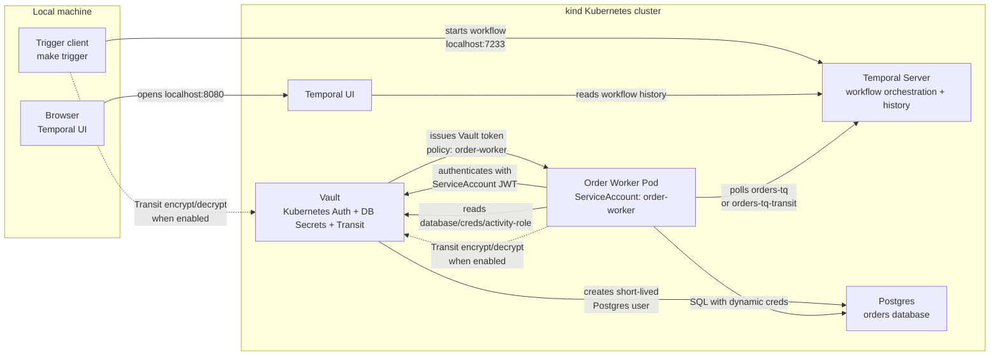
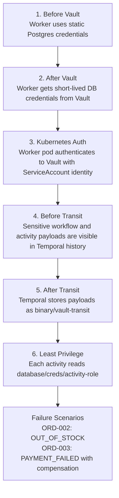

# Temporal Vault K8s Local Demo

Local-first reference demo showing how Temporal workflows can use Vault on Kubernetes for workload identity, dynamic database credentials, and payload protection.

Current status: Milestone 6 polish is in progress.

The demo now shows the main Vault security layers:

- before Vault: the worker uses static Postgres credentials
- after Vault: the worker gets short-lived Postgres credentials from Vault's database secrets engine
- after Kubernetes auth: the worker runs in Kubernetes and authenticates to Vault with its ServiceAccount identity
- after Transit: sensitive workflow payloads are encrypted before they are stored in Temporal history
- after least privilege: each activity gets a narrow database role instead of one broad worker credential

The full demo arc is:

1. Temporal orchestrates an order workflow.
2. Vault protects the worker's database access.
3. Vault Kubernetes auth removes static Vault tokens.
4. Vault Transit protects sensitive workflow payloads.
5. Least-privilege roles tighten each activity's database access.

## Milestones

- [Roadmap](docs/roadmap.md)
- [Milestone 1: Local Temporal + Postgres](docs/milestone-1.md)
- [Milestone 2: Add Vault](docs/milestone-2.md)
- [Milestone 3: Vault Kubernetes Auth](docs/milestone-3.md)
- [Milestone 4: Vault Transit Payload Encryption](docs/milestone-4.md)
- [Milestone 5: Least Privilege + Failure Scenarios](docs/milestone-5.md)
- [Blog outline](docs/blog-outline.md)

## Prerequisites

- Docker
- `kind`
- `kubectl`
- Python 3.12
- `uv`

## Quick Start

```bash
make install
make up
make deploy
make wait
make db-init
make vault-init
```

After `make port-forward-ui` is running, Temporal UI is available at:

```text
http://localhost:8080
```

## Demo Walkthrough

The demo is easiest to run with a few terminals:

- one terminal for port-forwards
- one terminal for the worker, when running a local worker
- one terminal for trigger commands

Keep these port-forwards open for local workers and browser inspection:

```bash
make port-forward-temporal
make port-forward-postgres
make port-forward-vault
make port-forward-ui
```

You can also run all four in one terminal:

```bash
make port-forward
```

For a narrated version of the same flow, use the numbered scripts in [scripts/demo](scripts/demo/README.md). They print the demo intent, run the underlying `make` commands, and call out what to show in Temporal UI, Vault, logs, and Postgres.

### 1. Before Vault: Static Database Credentials

Start the local worker without Vault-issued database credentials:

```bash
make worker
```

Trigger the happy-path order:

```bash
make trigger ORDER_ID=ORD-001
```

The worker logs should show:

```text
db_credential_source=static
```

### 2. After Vault: Dynamic Database Credentials

Refresh Vault's database secrets engine:

```bash
make vault-init
```

Start the local worker with Vault-issued database credentials:

```bash
make worker-vault
```

Trigger the happy-path order:

```bash
make trigger ORDER_ID=ORD-001
```

The worker logs should show generated Postgres usernames, for example:

```text
db_credential_source=vault
v-token-order-...
```

### 3. After Kubernetes Auth: Worker Identity

Run the worker inside Kubernetes and let it authenticate to Vault with its ServiceAccount identity:

```bash
make worker-k8s
make trigger ORDER_ID=ORD-001
make logs-worker
```

The worker logs should show:

```text
vault_auth_method=kubernetes
v-kubernet-order-...
```

The `order-worker` name in this step is the Kubernetes ServiceAccount, Vault auth role, and Vault policy name. It is not a broad database role.

### 4. Before Transit: Sensitive Payloads Visible

With the normal Kubernetes worker running, trigger the happy-path order:

```bash
make worker-k8s
make trigger ORDER_ID=ORD-001
```

In Temporal UI, inspect the workflow input and activity inputs. Before Transit, values like these are visible in history:

```text
avery.stone@example.com
42 Market Street, Berlin
tok_demo_visa_4242_sensitive
```

### 5. After Transit: Sensitive Payloads Encrypted

Run the Kubernetes worker with the Vault Transit payload codec enabled:

```bash
make worker-k8s-transit
make trigger-transit ORDER_ID=ORD-001
make logs-worker
```

The Transit path uses task queue `orders-tq-transit`, separate from the plaintext queue `orders-tq`. In Temporal UI, encoded payloads should no longer reveal the sensitive values directly and should show metadata such as:

```text
binary/vault-transit
```

### 6. Least Privilege + Failure Scenarios

Reset the demo data:

```bash
make db-init
```

Run the Kubernetes worker:

```bash
make worker-k8s
```

Trigger the three demo orders:

```bash
make trigger ORDER_ID=ORD-001
make trigger ORDER_ID=ORD-002
make trigger ORDER_ID=ORD-003
```

`ORD-002` and `ORD-003` are expected to fail at the workflow level. They demonstrate business failures, not broken infrastructure.

Expected outcomes:

```text
ORD-001: FULFILLED
ORD-002: OUT_OF_STOCK
ORD-003: PAYMENT_FAILED
```

Verify the narrow Vault database roles:

```bash
make vault-init
make vault-test-db-creds
make logs-worker
```

`make vault-init` should list only the activity-specific database roles:

```text
order-fail
order-fulfill
order-process-payment
order-release-inventory
order-reserve-inventory
order-send-notification
order-validate
```

## Useful Commands

```bash
make status
make vault-init
make vault-read-db-creds
make vault-test-db-creds
make port-forward-temporal
make port-forward-postgres
make port-forward-vault
make port-forward-ui
make logs-temporal
make logs-postgres
make logs-vault
make worker
make worker-vault
make worker-k8s
make worker-k8s-transit
make trigger-transit
make logs-worker
make db-shell
make down
```

## Reset And Troubleshooting

Reset only the demo data:

```bash
make db-init
```

Rebuild and redeploy the Kubernetes worker:

```bash
make worker-k8s
```

Enable the Transit worker path:

```bash
make worker-k8s-transit
```

Delete the whole local cluster:

```bash
make down
```

If a trigger fails with `Connection refused` for `localhost:7233`, start or restart the Temporal port-forward:

```bash
make port-forward-temporal
```

If Temporal UI is not reachable at `http://localhost:8080`, start or restart:

```bash
make port-forward-ui
```

If a port-forward says the port is already allocated, another terminal is probably already forwarding that port. Use the existing terminal, stop the old port-forward with `Ctrl-C`, or change the local port manually.

If the worker seems to run old code, rebuild and redeploy it:

```bash
make worker-k8s
```

The worker image tag defaults to the current git commit. If you are testing uncommitted code repeatedly, pass an explicit tag:

```bash
make worker-k8s WORKER_IMAGE_TAG=demo-test
```

Vault runs in dev mode. If the Vault pod restarts, rerun:

```bash
make vault-init
make vault-init-transit
make vault-enable-k8s-auth
```

`ORD-002` and `ORD-003` intentionally fail at the workflow level. They should still leave the expected order statuses in Postgres:

```text
ORD-002: OUT_OF_STOCK
ORD-003: PAYMENT_FAILED
```

For a full fresh start:

```bash
make down
make up
make deploy
make wait
make db-init
make vault-init
```

## Current Demo

The current workflow supports three demo orders:

- `ORD-001`: validates, reserves inventory, processes payment, marks fulfilled, sends notification
- `ORD-002`: out of stock
- `ORD-003`: payment failure with inventory compensation

The workflow input and selected activity inputs include demo-sensitive fields so the Transit before/after is visible in Temporal UI:

- `customer_email`
- `shipping_address`
- `payment_token`

Successful runs leave this database state:

```text
orders:                  ORD-001 -> FULFILLED
inventory_reservations:  ORD-001 -> WIDGET-001 qty 1
payments:                ORD-001 -> 19.99 SUCCESS
notifications:           ORD-001 -> ORDER_FULFILLED SENT
```

Failure scenario outcomes:

```text
ORD-002: OUT_OF_STOCK, no reservation, no payment
ORD-003: PAYMENT_FAILED, inventory reservation released, payment FAILED
```

Vault database credentials are now requested per activity role, for example:

```text
validate_order -> order-validate
process_payment -> order-process-payment
send_notification -> order-send-notification
```

The older broad `order-worker` database role has been removed. The `order-worker` name still appears as the Kubernetes ServiceAccount and Vault auth role name, but database credentials come from the narrower activity roles.

The credential and payload progression is:

```text
make worker        -> db_credential_source=static
make worker-vault  -> db_credential_source=vault
make worker-k8s    -> db_credential_source=vault, vault_auth_method=kubernetes
make trigger-transit -> workflow payloads encrypted with Vault Transit
```

In Vault mode, the worker logs generated Postgres usernames such as `v-token-order-...` for token auth and `v-kubernet-order-...` for Kubernetes auth.

Completed milestone details are captured in:

- [docs/milestone-1.md](docs/milestone-1.md)
- [docs/milestone-2.md](docs/milestone-2.md)
- [docs/milestone-3.md](docs/milestone-3.md)
- [docs/milestone-4.md](docs/milestone-4.md)
- [docs/milestone-5.md](docs/milestone-5.md)

Milestone 5 added:

- per-activity least-privilege database roles
- `ORD-002` out-of-stock failure
- `ORD-003` payment failure with compensation

Future scope:

- future Vault PKI + Temporal mTLS

## Target Architecture



Current status: the worker runs in Kubernetes, authenticates to Vault with Kubernetes auth, gets per-activity dynamic Postgres credentials, and can optionally encrypt Temporal payloads with Vault Transit. The trigger client still runs locally.

## Demo Flow



## Notes

This is a local development demo, not a production deployment. Vault still runs in dev mode, and setup scripts still use the root token to configure Vault. The Kubernetes worker runtime uses Vault Kubernetes auth instead of the root token.
