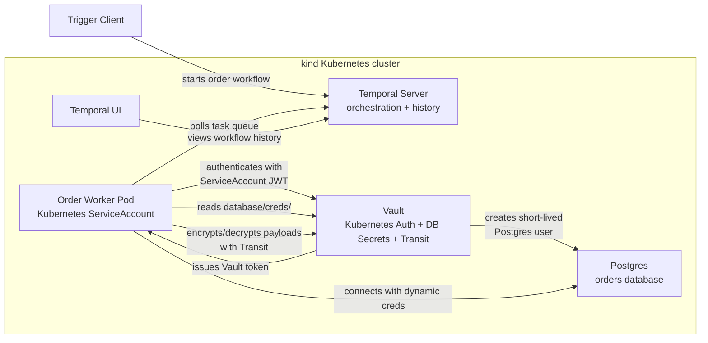

# Temporal Vault K8s Local Demo

Local-first reference demo showing how Temporal workflows can use Vault on Kubernetes for workload identity, dynamic database credentials, and payload protection.

Current status: Milestone 3 is complete.

The demo now shows the first two Vault security steps:

- before Vault: the worker uses static Postgres credentials
- after Vault: the worker gets short-lived Postgres credentials from Vault's database secrets engine
- after Kubernetes auth: the worker runs in Kubernetes and authenticates to Vault with its ServiceAccount identity

The full demo arc is:

1. Temporal orchestrates an order workflow.
2. Vault protects the worker's database access.
3. Vault Kubernetes auth removes static Vault tokens.
4. Vault Transit protects sensitive workflow payloads.
5. Least-privilege roles tighten each activity's database access.

## Milestones

- [Roadmap](docs/roadmap.md)
- [Milestone 1: Local Temporal + Postgres](docs/milestone-1.md)
- [Milestone 2: Add Vault](docs/milestone-2.md)
- [Milestone 3: Vault Kubernetes Auth](docs/milestone-3.md)
- [Blog outline](docs/blog-outline.md)

## Prerequisites

- Docker
- `kind`
- `kubectl`
- Python 3.12
- `uv`

## Quick Start

```bash
make install
make up
make deploy
make wait
make db-init
make vault-init
```

Keep these long-running port-forwards open while using the local worker:

```bash
make port-forward-temporal
make port-forward-postgres
make port-forward-vault
make port-forward-ui
```

Alternatively, run all four in one terminal:

```bash
make port-forward
```

In another terminal, start the before-Vault worker with static database credentials:

```bash
make worker
```

Or start the after-Vault worker with dynamic database credentials:

```bash
make worker-vault
```

In a third terminal, trigger the happy-path order:

```bash
make trigger ORDER_ID=ORD-001
```

To run the Milestone 3 Kubernetes-auth worker instead of the local worker:

```bash
make worker-k8s
make trigger ORDER_ID=ORD-001
make logs-worker
```

Temporal UI is available at:

```text
http://localhost:8080
```

## Useful Commands

```bash
make status
make vault-init
make vault-read-db-creds
make vault-test-db-creds
make port-forward-temporal
make port-forward-postgres
make port-forward-vault
make port-forward-ui
make logs-temporal
make logs-postgres
make logs-vault
make worker
make worker-vault
make worker-k8s
make logs-worker
make db-shell
make down
```

## Current Demo

The current workflow supports the `ORD-001` happy path:

- `ORD-001`: validates, reserves inventory, processes payment, marks fulfilled, sends notification

Successful runs leave this database state:

```text
orders:                  ORD-001 -> FULFILLED
inventory_reservations:  ORD-001 -> WIDGET-001 qty 1
payments:                ORD-001 -> 19.99 SUCCESS
notifications:           ORD-001 -> ORDER_FULFILLED SENT
```

The before/after demo is:

```text
make worker        -> db_credential_source=static
make worker-vault  -> db_credential_source=vault
make worker-k8s    -> db_credential_source=vault, vault_auth_method=kubernetes
```

In Vault mode, the worker logs generated Postgres usernames such as `v-token-order-...` for token auth and `v-kubernet-order-...` for Kubernetes auth.

Before Vault:

```bash
make worker
make trigger ORDER_ID=ORD-001
```

After Vault:

```bash
make vault-init
make worker-vault
make trigger ORDER_ID=ORD-001
```

After Kubernetes auth:

```bash
make worker-k8s
make trigger ORDER_ID=ORD-001
make logs-worker
```

Completed milestone details are captured in [docs/milestone-1.md](docs/milestone-1.md), [docs/milestone-2.md](docs/milestone-2.md), and [docs/milestone-3.md](docs/milestone-3.md).

Later milestones add:

- Vault Transit payload encryption
- per-activity least-privilege database roles
- `ORD-002` out-of-stock failure
- `ORD-003` payment failure with compensation
- future Vault PKI + Temporal mTLS

## Target Architecture



Current status: Milestone 3 moved the worker into Kubernetes and replaced the worker's `VAULT_TOKEN=root` runtime path with Vault Kubernetes auth. The trigger client still runs locally.

## Notes

This is a local development demo, not a production deployment. Vault still runs in dev mode, and setup scripts still use the root token to configure Vault. The Milestone 3 worker runtime uses Vault Kubernetes auth instead of the root token.
