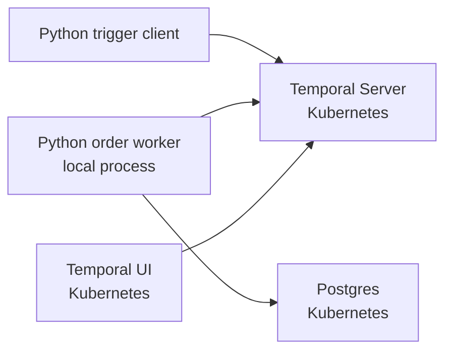

# Temporal Vault K8s Local Demo

Local-first demo for Temporal, Postgres, Vault, and Kubernetes.

Milestone 1 proves the workflow loop before Vault is added:

- create a local `kind` cluster
- run Postgres in Kubernetes
- run Temporal and Temporal UI in Kubernetes
- run a Python Temporal worker from your laptop
- trigger `ORD-001` from a Python client

Vault is intentionally out of scope for Milestone 1. It starts in Milestone 2.

## Milestones

- [Milestone 1: Local Temporal + Postgres](docs/milestone-1.md)
- [Milestone 2: Add Vault](docs/milestone-2.md)

## Prerequisites

- Docker
- `kind`
- `kubectl`
- Python 3.12
- `uv`

## Quick Start

```bash
make install
make up
make deploy
make wait
make db-init
make vault-init
```

Keep these long-running port-forwards open while using the local worker:

```bash
make port-forward-temporal
make port-forward-postgres
make port-forward-vault
make port-forward-ui
```

Alternatively, run all four in one terminal:

```bash
make port-forward
```

In another terminal, start the worker.

```bash
make worker
```

For the after-Vault demo, start the worker with dynamic database credentials:

```bash
make worker-vault
```

In a third terminal, trigger the happy-path order:

```bash
make trigger ORDER_ID=ORD-001
```

Temporal UI is available at:

```text
http://localhost:8080
```

## Useful Commands

```bash
make status
make vault-init
make vault-read-db-creds
make vault-test-db-creds
make port-forward-temporal
make port-forward-postgres
make port-forward-vault
make port-forward-ui
make logs-temporal
make logs-postgres
make logs-vault
make worker
make worker-vault
make db-shell
make down
```

## Milestone 1 Scope

This milestone includes only the happy path:

- `ORD-001`: validates, reserves inventory, processes payment, marks fulfilled, sends notification

Later milestones add:

- Vault in Kubernetes
- dynamic Postgres credentials
- Vault Kubernetes auth
- per-activity least-privilege database roles
- `ORD-002` out-of-stock failure
- `ORD-003` payment failure with compensation

Milestone 1 has been verified locally. The completed run left:

```text
orders:                  ORD-001 -> FULFILLED
inventory_reservations:  ORD-001 -> WIDGET-001 qty 1
payments:                ORD-001 -> 19.99 SUCCESS
notifications:           ORD-001 -> ORDER_FULFILLED SENT
```

Milestone 2 has started. Vault now runs in Kubernetes, is reachable at `http://localhost:8200`, and can issue dynamic Postgres credentials for the broad `order-worker` role.

The before/after demo is:

```text
make worker        -> db_credential_source=static
make worker-vault  -> db_credential_source=vault
```

In Vault mode, the worker logs generated Postgres usernames such as `v-token-order-...`.

## Architecture



## Notes

This is a local development demo, not a production deployment. Credentials are static in Milestone 1 so the Temporal and database loop is easy to inspect. Vault replaces that in later milestones.
