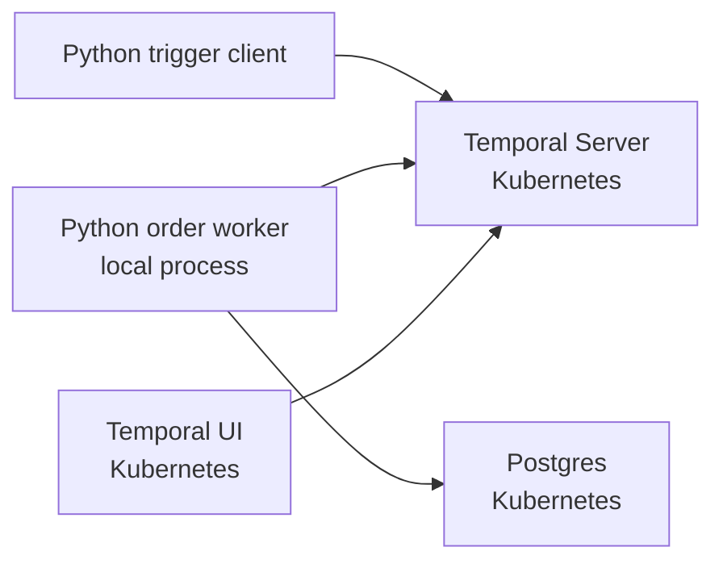

# Temporal Vault K8s Local Demo

Local-first demo for Temporal, Postgres, Vault, and Kubernetes.

Milestone 1 proves the workflow loop before Vault is added:

- create a local `kind` cluster
- run Postgres in Kubernetes
- run Temporal and Temporal UI in Kubernetes
- run a Python Temporal worker from your laptop
- trigger `ORD-001` from a Python client

Vault is intentionally out of scope for Milestone 1. It starts in Milestone 2.

## Prerequisites

- Docker
- `kind`
- `kubectl`
- Python 3.12
- `uv`

## Quick Start

```bash
make install
make up
make deploy
make wait
make db-init
```

In one terminal, keep port forwarding open:

```bash
make port-forward
```

In another terminal, start the worker:

```bash
make worker
```

In a third terminal, trigger the happy-path order:

```bash
make trigger ORDER_ID=ORD-001
```

Temporal UI is available at:

```text
http://localhost:8080
```

## Useful Commands

```bash
make status
make logs-temporal
make logs-postgres
make db-shell
make down
```

## Milestone 1 Scope

This milestone includes only the happy path:

- `ORD-001`: validates, reserves inventory, processes payment, marks fulfilled, sends notification

Later milestones add:

- Vault in Kubernetes
- dynamic Postgres credentials
- Vault Kubernetes auth
- per-activity least-privilege database roles
- `ORD-002` out-of-stock failure
- `ORD-003` payment failure with compensation

## Architecture



## Notes

This is a local development demo, not a production deployment. Credentials are static in Milestone 1 so the Temporal and database loop is easy to inspect. Vault replaces that in later milestones.
