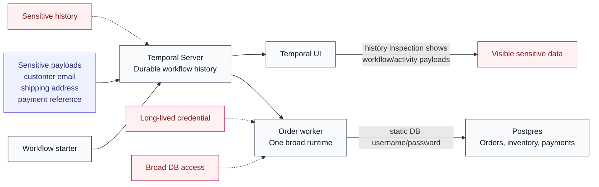
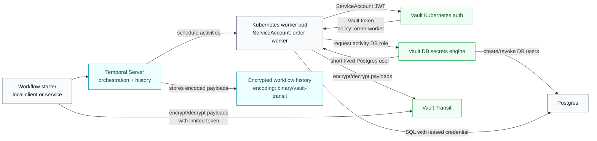
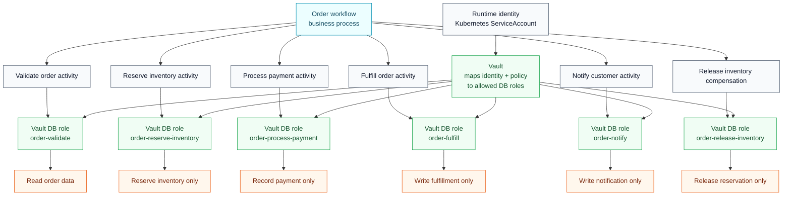

# Blog Diagrams

These diagrams support the blog draft in [blog-draft.md](blog-draft.md). They are concept diagrams, not step-by-step run instructions.

## 1. Problem: One Worker, Too Much Trust

## 2. Solution: Temporal Orchestrates, Vault Secures

## 3. Least Privilege: Activities as Security Boundaries

