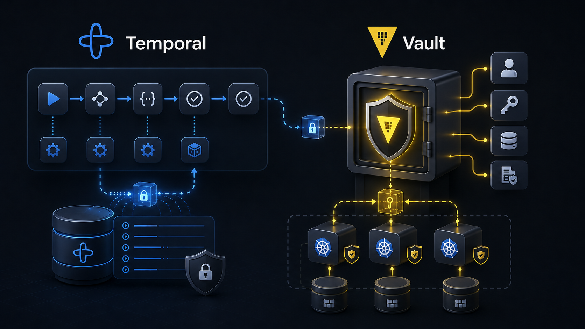
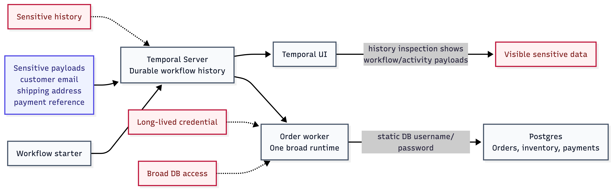
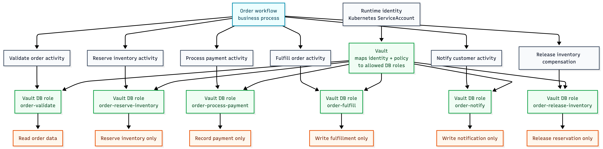
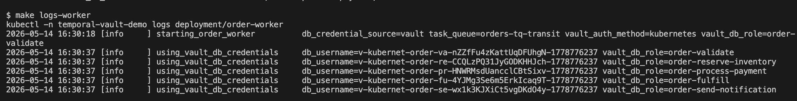
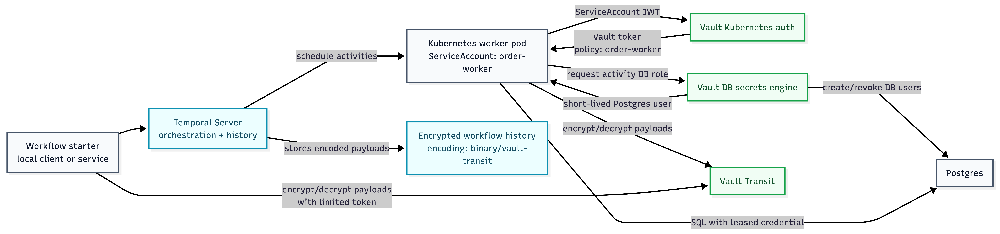
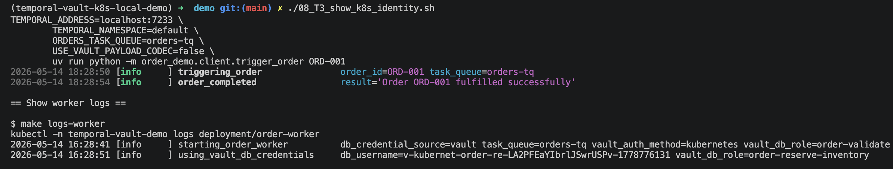
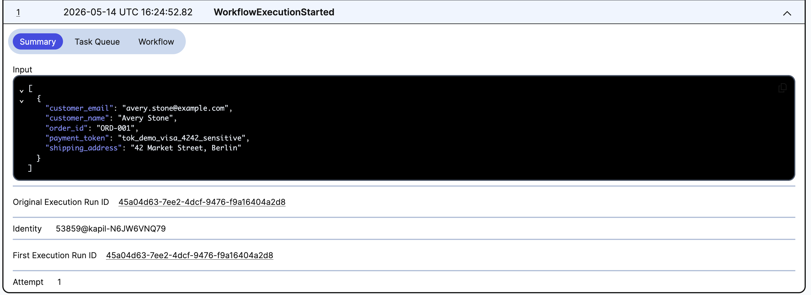
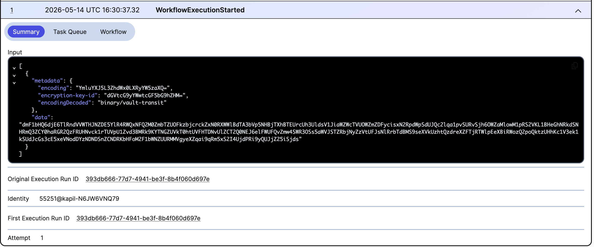

# Securing Temporal Workflows with Vault



Temporal is very good at making business processes durable. That durability is exactly why many teams adopt it: workflows survive worker restarts, activities can retry, failures are recorded, and the full execution history remains available for debugging and recovery.

But once a workflow becomes durable, the security model changes.

The data that moves through the workflow is no longer just passing through a short-lived request handler. It may be stored in workflow history. Activity inputs and outputs may be visible in the Temporal UI. Workers may need database access across many different business steps. Retries and compensations may repeat sensitive operations. A single "order worker" can easily become a process with broad credentials, broad database access, and access to data that different parts of the business should not all see equally.

This post is for readers who already understand why Temporal is useful. The question here is narrower:

How do we secure a Temporal workflow without losing the programming model that made Temporal attractive in the first place?

The answer I wanted to explore is this:

Temporal should orchestrate durable business processes. Vault should provide the security control plane around those processes.

That means Vault is responsible for workload identity, short-lived database credentials, payload protection, and policy-driven access. Temporal remains responsible for workflow orchestration, retries, durable execution, and business state transitions.

## The Business Problem

Consider a simple order workflow:

```text
validate order -> reserve inventory -> process payment -> fulfill order -> notify customer
```

This is intentionally ordinary. That is what makes it useful.

An order workflow may touch customer information, shipping addresses, payment references, inventory records, fulfillment status, and notification state. Some of this data is sensitive. Some operations need write access. Some should only read. Some should only happen if earlier steps succeeded. Some require compensation when a later step fails.

If we run this as a normal service, it is common to give the service one runtime identity and one database credential. The service validates orders, reserves inventory, records payments, updates fulfillment, sends notifications, and compensates failures. Over time, the credential becomes broader because the service does many things.

Temporal gives us a better boundary.

The workflow is already decomposed into activities. Each activity represents a specific business capability. That gives us a natural place to ask security questions:

- What identity is running this activity?
- What database access does this activity actually need?
- Should this activity see the full workflow payload?
- Should this activity be allowed to write to this table?
- What happens if this activity fails and a compensation activity runs?

This is where Temporal and Vault fit together nicely.

## The Security Problems

There are four security problems I wanted the demo to make visible.



First, static database credentials are too broad and too long-lived. If a worker has a fixed Postgres username and password, that credential can leak, be reused, or remain valid longer than it should.

Second, Vault itself has a Secret Zero problem. If the worker uses Vault to get credentials, how does the worker safely authenticate to Vault? Putting a static Vault token into the worker environment is only a partial improvement.

Third, Temporal history can contain sensitive payloads. Workflow inputs, activity inputs, activity results, failure details, and retry history are all useful operationally, but that also means sensitive fields can become visible in places like Temporal UI.

Fourth, least privilege is hard when one worker process does many business operations. A worker that validates orders, reserves inventory, processes payments, fulfills shipments, and writes notifications can easily accumulate access to every table involved in the workflow.

The interesting part is that Temporal already gives us a structure for solving the fourth problem.

## Activities as Security Boundaries

Temporal activities are usually discussed as execution boundaries: they are where side effects happen, where retries apply, and where interaction with external systems belongs.

They can also be security boundaries.

In an order workflow, the validation activity does not need the same database permissions as the payment activity. The notification activity does not need to update inventory. A compensation activity should have only the access required to reverse the reservation state.

That means an activity is a useful unit for least privilege.



In the local demo, I used one common codebase and one worker implementation, but the worker requests different Vault database roles for different activities:

```text
validate order        -> order-validate
reserve inventory    -> order-reserve-inventory
process payment      -> order-process-payment
fulfill order        -> order-fulfill
notify customer      -> order-notify
release inventory    -> order-release-inventory
```

That already improves the model. The database credential used by an activity is scoped to that activity's job. The old broad `order-worker` database role is removed.



In a more production-shaped deployment, the same idea can go further. Activities can be split across task queues and worker deployments. Each deployment can run the same codebase but use a different Kubernetes ServiceAccount. Vault can then map each ServiceAccount identity to the exact policies and database roles that worker is allowed to use.

That is the game changer:

One business workflow. One shared codebase if you want it. Multiple runtime identities. Different Vault policies. Different database access per activity or activity group.

Temporal gives the business process structure. Kubernetes gives the workload identity. Vault turns that identity into narrowly scoped, short-lived access.

## The Pattern

The pattern looks like this:



```text
Temporal workflow
  -> schedules activities
  -> activities run in workers
  -> workers authenticate to Vault with Kubernetes identity
  -> Vault issues short-lived database credentials
  -> Vault Transit protects sensitive workflow payloads
```

There are three Vault integrations doing different jobs.

Vault database secrets engine issues short-lived Postgres credentials. The worker does not need a long-lived database password. Credentials can be leased, rotated, and revoked.



Vault Kubernetes auth lets the worker prove its identity using its Kubernetes ServiceAccount. The worker no longer needs a static Vault root token or manually distributed Vault token.

Vault Transit encrypts Temporal payloads before they are stored in Temporal history. Temporal still orchestrates the workflow, but sensitive payload fields are no longer stored as plain JSON in workflow history.

The architecture is intentionally layered:

- Dynamic database credentials reduce the blast radius of database access.
- Kubernetes auth removes static Vault tokens from the worker runtime.
- Transit protects sensitive workflow and activity payloads from casual visibility in Temporal history.
- Per-activity database roles make least privilege practical inside the workflow.

None of these replaces Temporal. They surround the Temporal worker with stronger security controls.

## Why Payload Protection Matters

Temporal history is supposed to be durable. That is a feature, not a bug.

But durable history changes the way we should think about sensitive data. In a request-response service, a customer email, shipping address, or payment token might be handled briefly and then disappear from process memory. In a workflow system, those values may be part of workflow inputs, activity inputs, activity outputs, failure messages, or retry history.

That is useful for debugging. It is also a security concern.

In the demo, the order input includes fields such as customer email, shipping address, and payment reference. Before Transit, those values are visible in Temporal UI when inspecting workflow and activity payloads. After Transit is enabled, Temporal stores encoded encrypted payloads instead.





Vault Transit gives us a clean separation of responsibility:

- Temporal stores durable workflow history.
- Vault owns the encryption key and encrypt/decrypt operations.
- Authorized clients and workers can decode payloads when needed.
- Unprotected views of Temporal history do not reveal the sensitive fields directly.

This does not remove the need for Temporal authorization, network security, or operational discipline. It does make the stored workflow history safer by default.

## What the Local Demo Proves

I built a local demo using Temporal, Vault, Postgres, Kubernetes, and `kind` to make the pattern concrete.

The demo starts with a working Temporal order workflow. Then it walks through the security journey:

1. Run the workflow with static Postgres credentials.
2. Show sensitive workflow and activity payloads in Temporal history.
3. Replace static database credentials with Vault dynamic database credentials.
4. Move the worker into Kubernetes and authenticate to Vault using Kubernetes auth.
5. Enable Vault Transit so sensitive payloads are encrypted in Temporal history.
6. Use per-activity Vault database roles instead of one broad worker database role.
7. Run success and failure scenarios to prove the workflow still behaves correctly.

The repository is the runnable proof behind the article. The main point here is the architecture pattern, not the exact local commands.

Still, the local environment is useful because it makes the before-and-after visible. You can see static credentials become Vault-issued usernames. You can see sensitive payloads in Temporal UI before Transit. You can see encrypted payloads after Transit. You can see activity-specific Vault database roles instead of one broad worker role.

## What This Does Not Solve

The demo is intentionally local-first. It is not a production deployment.

Vault runs in dev mode. The setup scripts use a root token to configure the local demo. The Kubernetes cluster is `kind`. Temporal is not hardened with production TLS, mTLS, or authorization. Audit logging, policy lifecycle, secret rotation runbooks, backup and restore, and production Vault storage are outside the scope of the demo.

Vault PKI and Temporal mTLS are also future scope. They would be a natural next layer, especially if the goal is to secure worker-to-Temporal communication with certificates issued and rotated by Vault.

There is also a useful distinction between payload encryption and UI decode ergonomics. The demo uses a Python Temporal payload codec backed by Vault Transit. A production environment may also want a codec server so authorized users can decode payloads through approved tooling without weakening the default storage posture.

## The Takeaway

Temporal makes long-running business processes easier to model and operate. But the same durability that makes Temporal powerful also makes security design more important.

Vault complements Temporal because it owns a different set of concerns:

- Who is this worker?
- What is this worker allowed to access?
- How long should this database credential live?
- Which activity needs which permissions?
- Should this payload be visible in stored workflow history?

The most important realization for me was that Temporal activities are not only programming boundaries. They can become security boundaries.

Once you see activities that way, least privilege becomes much more practical. You can keep one workflow. You can keep one codebase. But you do not have to give every step the same identity, the same database permissions, or the same access to sensitive data.

That is the real value of combining Temporal with Vault:

Temporal gives you durable orchestration. Vault gives you policy-driven access around that orchestration.

Together, they let you build workflows that are not only reliable, but meaningfully securable.

## Resources

- GitHub repository: [temporal-vault-k8s-local-demo](https://github.com/kaparora/temporal-vault-k8s-local-demo)
