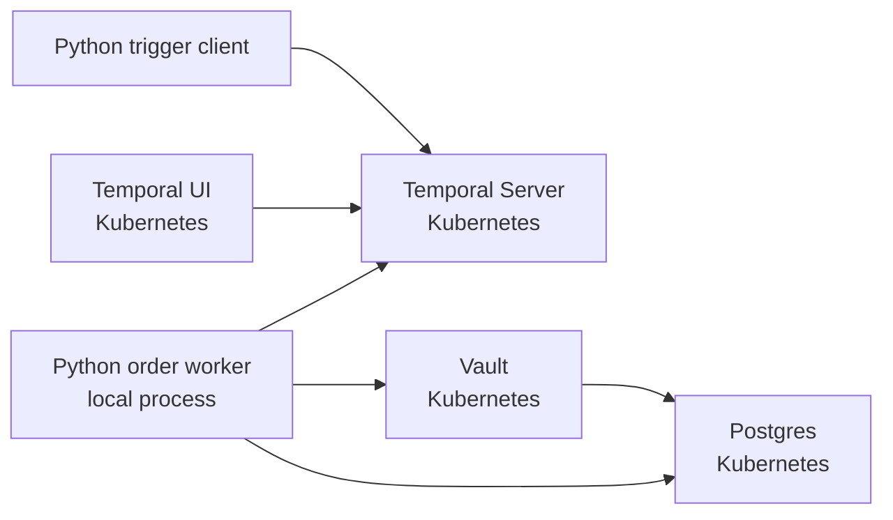

# Milestone 2: Add Vault

## Goal

Introduce Vault into the local Kubernetes stack while keeping the order workflow behavior unchanged.

Status: complete.

Milestone 2 proves one new thing:

```text
the worker can fetch short-lived Postgres credentials from Vault and still fulfill ORD-001
```

This milestone should not introduce Kubernetes auth or per-activity database roles yet. Those are later milestones.

## Current Baseline

Milestone 1 already provides:

- `kind` cluster
- Postgres in Kubernetes
- Temporal and Temporal UI in Kubernetes
- local Python order worker
- local Python trigger client
- `ORD-001` happy path
- static Postgres credentials passed to the worker through environment variables

## Target Shape



The worker should connect to Vault first, request database credentials, then use those credentials for Postgres activity writes.

## Implementation Summary

1. Run Vault in Kubernetes.
   - Add a Vault deployment and service.
   - Use dev mode for this local milestone.
   - Expose Vault locally with `kubectl port-forward`.

2. Configure the Vault database secrets engine.
   - Enable the database secrets engine.
   - Configure a Postgres connection using an admin/bootstrap Postgres credential.
   - Create one database role for the order worker.
   - Verify the generated credential can query the demo database.

3. Add local commands.
   - `make vault-init` to configure Vault.
   - `make port-forward-vault` to expose Vault locally.
   - Update `make port-forward` to include Vault once the individual command works.

4. Add Python Vault integration.
   - Add `hvac` as a dependency.
   - Add a small Vault client helper.
   - The worker reads `VAULT_ADDR`, `VAULT_TOKEN`, and a database role name.
   - The activity connection helper asks Vault for Postgres credentials.

5. Keep the order flow unchanged.
   - `make trigger ORDER_ID=ORD-001` should still complete successfully.
   - Database state should still show fulfilled order, reservation, payment, and notification.

## Proposed Environment Variables

```text
VAULT_ADDR=http://localhost:8200
VAULT_TOKEN=root
VAULT_DB_MOUNT=database
VAULT_DB_ROLE=order-worker
```

Milestone 2 can still use a static root token because the goal is dynamic database credentials, not worker identity. Kubernetes auth replaces this in Milestone 3.

## Database Role

Use one broad role first:

```text
order-worker
```

It should be able to read and write the demo tables needed by all Milestone 1 activities.

Per-activity roles are intentionally deferred:

- `role-read-orders`
- `role-write-inventory`
- `role-write-payments`
- `role-write-orders`
- `role-write-notifications`

Those belong in Milestone 4, after Kubernetes auth is working.

## Commands

Expected happy path after implementation:

```bash
make install
make up
make deploy
make wait
make db-init
make vault-init
make vault-test-db-creds
```

Long-running terminals:

```bash
make port-forward-temporal
make port-forward-postgres
make port-forward-vault
make port-forward-ui
```

Worker and trigger:

```bash
make worker
make worker-vault
make trigger ORDER_ID=ORD-001
```

## Verification

Milestone 2 is complete:

- Vault runs in the `temporal-vault-demo` namespace.
- Vault is reachable at `http://localhost:8200` through port-forwarding.
- Vault database secrets engine is configured for the local Postgres service.
- `make vault-test-db-creds` proves a dynamic Vault credential can query Postgres.
- The worker fetches short-lived Postgres credentials from Vault.
- `ORD-001` completes successfully.
- Postgres confirms the order was fulfilled with payment and notification records.
- README documents the new Vault commands.
- The docs clearly state what remains non-production-ready.

The key worker log evidence is:

```text
starting_order_worker db_credential_source=vault
using_vault_db_credentials db_username=v-token-order-...
```

## Non-Scope

Do not include yet:

- Vault Kubernetes auth
- service-account based worker identity
- per-activity database roles
- `ORD-002` out-of-stock flow
- `ORD-003` payment failure and inventory compensation
- production Vault storage, unseal flow, HA, TLS, or policy hardening

## Risks And Notes

- Vault dev mode is intentionally insecure. It is acceptable only because this is a local demo milestone.
- `VAULT_TOKEN=root` should never be presented as production guidance.
- The first dynamic DB role can be broad so we can isolate the Vault credential flow before adding least privilege.
- The worker runs locally in Milestone 2, so Vault is accessed through port-forwarding. In later milestones, the worker may move into Kubernetes or use Kubernetes auth from a pod identity.

## Completed

- Vault runs in Kubernetes dev mode.
- Vault is reachable locally through `make port-forward-vault`.
- `make vault-init` enables and configures the database secrets engine.
- `make vault-read-db-creds` returns a short-lived Postgres credential.
- `make vault-test-db-creds` verifies a generated credential can query the `orders` table.
- `make worker-vault` runs the order worker with `db_credential_source=vault`.
- `ORD-001` completes successfully through a Vault-backed worker.
- The worker logs generated Postgres usernames such as `v-token-order-...`.

## Future Improvements

- Decide whether to keep one generated credential per activity connection or cache a credential briefly inside the worker.
- Move from the static root token to Vault Kubernetes auth in Milestone 3.
