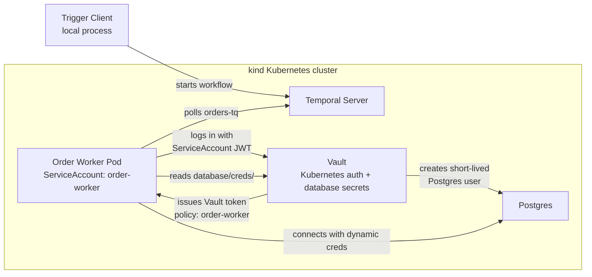

# Milestone 3: Vault Kubernetes Auth

Status: complete.

Milestone 3 removes the worker's static Vault root token path. The order worker now runs as a Kubernetes pod with a dedicated ServiceAccount and authenticates to Vault using Kubernetes auth.

## What This Proves

Milestone 2 proved:

```text
worker -> Vault root token -> dynamic Postgres credentials
```

Milestone 3 changes that to:

```text
worker pod -> Kubernetes ServiceAccount JWT -> Vault Kubernetes auth -> dynamic Postgres credentials
```

The worker still uses Vault-generated database users, but it no longer needs `VAULT_TOKEN=root`.

## Verification

Milestone 3 was verified with:

```bash
make worker-k8s
make trigger ORDER_ID=ORD-001
make logs-worker
```

The workflow completed successfully:

```text
Order ORD-001 fulfilled successfully
```

## Architecture



## New Pieces

- `k8s/order-worker.yaml`: Kubernetes ServiceAccount and Deployment for the order worker.
- `scripts/vault-enable-k8s-auth.sh`: enables Vault Kubernetes auth, configures the Kubernetes API connection, writes the worker policy, and creates the Vault auth role.
- `make worker-k8s`: builds the worker image, loads it into `kind`, configures Vault Kubernetes auth, and deploys the worker.
- `VAULT_AUTH_METHOD=kubernetes`: tells the worker to exchange its pod ServiceAccount JWT for a Vault token.

## Demo Commands

Start from the already deployed Milestone 2 stack:

```bash
make worker-k8s
```

`make worker-k8s` rebuilds and loads the worker image, refreshes the Vault manifest, reruns `vault-init`, enables Vault Kubernetes auth, and deploys the worker. The `vault-init` step is intentionally part of the target because Vault runs in dev mode and loses configuration if its pod restarts.

Note: `order-worker` is the Kubernetes ServiceAccount, Vault auth role, and Vault policy name. Current database credentials are issued from narrower roles such as `order-validate` and `order-process-payment`.

Keep Temporal UI and Temporal frontend reachable from the laptop:

```bash
make port-forward-temporal
make port-forward-ui
```

Trigger the workflow:

```bash
make trigger ORDER_ID=ORD-001
```

Inspect worker logs:

```bash
make logs-worker
```

Expected log signal:

```text
starting_order_worker db_credential_source=vault vault_auth_method=kubernetes
using_vault_db_credentials db_username=v-kubernet-order-...
```

## Why This Matters

This is the first milestone where Vault trusts workload identity instead of a manually supplied token. In production terms, this is the difference between giving an application a shared secret and letting it prove, at runtime, "I am the order-worker ServiceAccount in this namespace."

That same identity foundation will be reused in the Transit milestone, where the worker will need permission to encrypt and decrypt sensitive workflow payloads.

## Caveats

- Vault still runs in dev mode with root token `root`.
- The root token is still used by setup scripts to configure Vault.
- The worker runtime path no longer uses the root token.
- The trigger client still runs locally.
- Temporal server still runs without mTLS or authorization.
